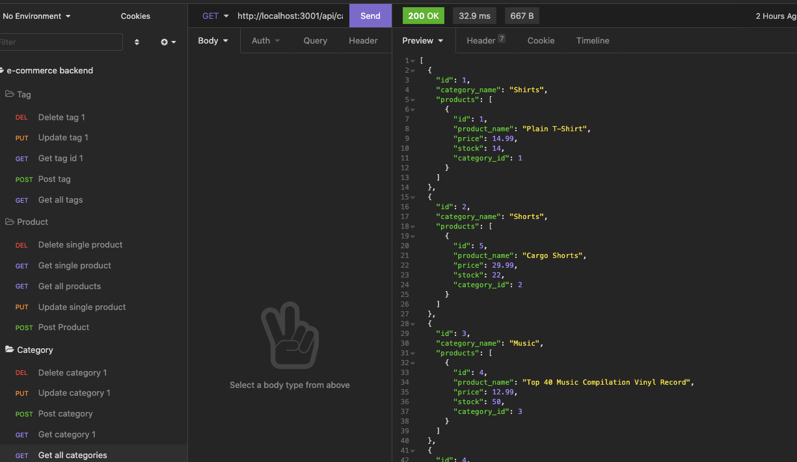

# e-commerce-backend

Backend of e-commerce siting using Express and MySQL (sequelize).

Screenshot using Insomia to test routes.



|                                         |                                         |                                                   |
| :-------------------------------------: | :-------------------------------------: | :-----------------------------------------------: |
|   [Introduction](#e-commerce-backend)   | [Table of Contents](#table-of-contents) | [Development Highlights](#development-highlights) |
|      [Installation](#installation)      |             [Usage](#usage)             |       [Code Hightlights](#code-highlights)        |
| [Technologies Used](#Technologies-Used) |           [Credits](#Credits)           |                [License](#License)                |

## Development Highlight

- Use Express for restful APIs.
- Define relationships between models.
- Use sequelize as the ORM for mySQL.
- Incorporate many to many relationship between products and tags through the product tag.
- Tested routes using Insomia.

## Installation

1. Create .env file with this content to configure MySQL to your computer:

```
DB_NAME=ecommerce_db
DB_USER=<YOUR_MYSQL_USERNAME>
DB_PW=<YOUR_MYSQL_USERNAME>
```

2. Install node modules

```
npm i
```

3. Source Schema

- Login to MySQL shell: `mysql -u <username> -p
- Run `source db/schema.sql

4. Seed tables

```
npm run seed
```

## Usage

```
npm start
```

Makes request using Port 3001.

### Category Routes

- Get all categories

  - `GET api/categories`

- Get category by ID

  - `GET api/categories/:id`

- Post category

  - Request Body: `{category_name: STRING}`
  - `POST api/categories`

- Update category by ID

  - Request Body: `{category_name: STRING}`
  - `PUT api/categories/:id`

- Delete category by ID

  - `DELETE api/categories/:id`

### Product Routes

- Get all products

  - `GET api/products`

- Get product by ID

  - `GET api/products/:id`

- Post product

  - Request Body: `{product_name: STRING, price: DECIMAL, stock: INTEGER, tagIds: Array<INTEGER>}`
  - `POST api/products

- Update product by ID

  - Request Body: `{product_name: STRING, price: DECIMAL, stock: INTEGER, tagIds: Array<INTEGER>}`
  - `PUT api/categories/:id`

- Delete product by ID

  - `DELETE api/products/:id`

### Tag Routes

- Get all tags

  - `GET api/tags`

- Get tag by ID

  - `GET api/tags/:id`

- Post tag

  - Request Body: `{tag_name: STRING}`
  - `POST api/tags`

- Update tag by ID

  - Request Body: `{tag_name: STRING}`
  - `PUT api/tags/:id`

- Delete tag by ID

  - `DELETE api/tags/:id`

## Code Highlights

Define Many to Many relationship between products and tags.

```JavaScript
ProductTag.init(
  {
    id: {
      type: DataTypes.INTEGER,
      allowNull: false,
      primaryKey: true,
      autoIncrement: true,
    },
    product_id: {
      type: DataTypes.INTEGER,
      references: {
        model: 'product',
        key: 'id'
      }
    },
    tag_id: {
      type: DataTypes.INTEGER,
      references: {
        model: 'tag',
        key: 'id'
      }
    }
  },
  {
    sequelize,
    timestamps: false,
    freezeTableName: true,
    underscored: true,
    modelName: 'product_tag',
  }
);
```

Finding all product information and including the category.

```JavaScript
router.get('/', (req, res) => {
  Product.findAll({
    include: [
      Category,
      {
        model: Tag,
        through: ProductTag
      }
    ]
  })
    .then(dbProductData => res.json(dbProductData))
    .catch(err => {
      console.log(err);
      res.status(500).json(err)
    })
});
```

## Technologies

### Backend Language

- [Node.js](https://nodejs.org/en/)

### Backend Framework

- [Express.js](https://expressjs.com/)

### Database

- [MySQL](https://www.mysql.com/)

### ORM

- [Sequelize](https://sequelize.org/)

## Credits

|                           |                                                                                                                                                                                                       |
| ------------------------- | ----------------------------------------------------------------------------------------------------------------------------------------------------------------------------------------------------- |
| **David Anusontarangkul** | [ LinkedIn](https://www.linkedin.com/in/anusontarangkul/) [ GitHub](https://github.com/anusontarangkul) |

## License

[](https://opensource.org/licenses/MIT)
